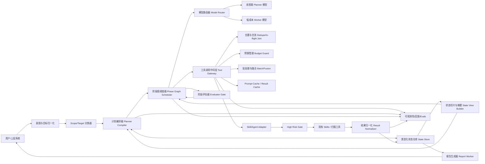
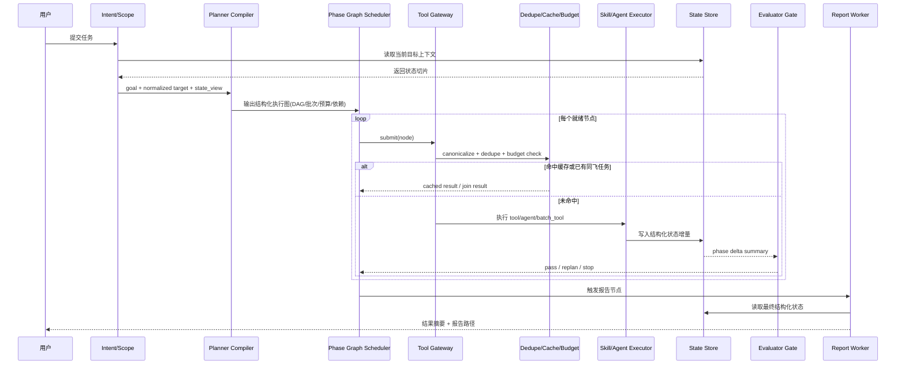

# 安全智能体重构分析报告

## 执行摘要

基于你当前提供的材料，我实际拿到的是四份核心信息源：`registry.py`、`planner.py`、`orchestrator.py`，以及一份较完整的系统架构文档 `ARCHITECTURE(1).md`。从这四份材料看，系统已经具备专家注册表、编排提示词、执行计划解析器、黑板/资产流/CMDB/Workflow 引擎等相当丰富的基础设施；但主问题也很集中：**固定扫描流程被放进了高自由度的 LLM 反应式循环里执行**，导致模型每推进一步都要重复读取规则、重复判断下一步、重复读状态、重复构造子任务 prompt，于是 token 成本和工具调用次数一起被放大。更关键的是，`planner.py` 已经定义了“结构化 JSON 执行计划 + 并行 batch”的抽象，而 `orchestrator.py` 在你给出的片段里仍然主要是长提示词和自然语言 hard rules，这两者之间存在明显的“契约错位”风险。fileciteturn0file1 fileciteturn0file2 fileciteturn0file3

我对当前架构的核心判断是：对你这种安全扫描主链，任务顺序高度可预测，Anthropic 和 LangGraph 都建议优先使用更简单、可组合、可验证的 workflow，而不是把大部分控制流都交给开放式 agent；OpenAI 的 reasoning best practices 也更倾向于让高智能模型先做“planner”，再让便宜、快的模型或确定性执行器去做“doer”。

因此，我建议把现有系统重构成一个 **“Workflow-first + Planner/Compiler + Tool Gateway + Typed State Store + Budgeted Replan”** 的目标架构。简单说，就是把现在写在 prompt 里的大量硬规则、顺序依赖、去重逻辑、预算控制，下沉到宿主态的**阶段图执行器**与**工具调用中间层**；让 LLM 只在三类场景中出手：**初始规划、异常重规划、结果综合**。在外部研究中，编译式函数调用与并行/融合执行带来了最高 3.7 倍的延迟改善和最高 6.7 倍的成本节省，某些运行时工具融合方法则报告过最高约 40% 的 token 成本下降；模型路由研究也显示，在不显著牺牲质量的前提下，成本可以做到 2 倍以上的下降。这些数字不能直接等价到你的安全场景，但它们至少说明：**“减少 round-trip + 收窄工具面 + 规划/执行分离”是正确方向**。

## 现状诊断与根因

### 证据边界

先说明边界：你这次没有提供真实调用日志，因此我对“重复调用具体发生在哪个 session、哪一组工具最频繁”暂时只能做**架构级定位**，还不能做账单级的精确归因。也就是说，下面的“高 token / 重复调用”诊断，主要依据是你给出的代码与架构约束，而不是生产 trace。这个边界不影响我给出重构方案，但会影响我对“最热调用链 top 10”和“具体节省百分比”的精度。

### 结构化计划与编排提示存在契约错位

`planner.py` 的设计意图很清晰：Orchestrator LLM 应该输出一个**结构化 JSON 执行计划**，其中包含 `reasoning`、`batches`、每个 batch 内的 `tasks(agent,args)`，从而支持并行 orchestrate。可是在你提供的 `orchestrator.py` 里，我看到的仍然是一套长篇的系统提示词拼接器，它强调 `create_agent`、`read_blackboard`、`read_assets`、`read_file` 等自然语言规则，却没有看到与 `ExecutionPlan` 对应的 JSON 输出契约。结果很可能是：**计划器的抽象存在，但前端 prompt 没把模型稳定约束到这个抽象里**，于是系统更像在做“每一步 reactive 决策”，而不是“先编译计划再执行”。这类错位通常会直接带来额外轮次、额外状态读取和额外 prompt 重复。

### 固定扫描主链被交给开放式 Agent 循环

`orchestrator.py` 里已经把自然顺序明确定义成 `asset_discovery → port_scan → crawl_web → vuln_detec → vuln_scan → (weak_password | pentest) → report`，并要求在委派下一个专家前先读黑板，在结束后一定要走报告代理。架构文档也把这个 VAPT 流水线描述成一条高度确定的阶段链。对于这种任务，Anthropic 和 LangGraph 的共同经验是：**预定义、顺序明确、成功标准可验证的任务，更适合 workflow；只有当子任务无法预先确定时，才更值得使用高自治 agent**。也就是说，你的系统目前把本可宿主态编码的阶段机，交给了 LLM 每轮都重新理解一次，这就是高 token 与高重复调用的最核心根因之一。

### 工具面过宽，光“看见工具”就先付出了 token 成本

架构文档说明，Operational Loop 会把完整文件操作、`curl`、`SpawnTool`、`BlackboardWrite/Read`、`AssetPush/Read`，以及 28+ 安全技能一起注册给运行中的 agent；而 `registry.py` 虽然支持 `minimal_tools`，但这个能力只是一个布尔开关，且当前提供的片段只显示它是“框架支持项”，不是“默认策略”。Anthropic 官方文档明确指出：`tools` 参数本身、`tool_use`/`tool_result` 内容块，以及启用工具模式时自动加入的特殊系统提示，都会增加 token 消耗。换句话说，只要工具面过宽，模型即使没有真正调用某个工具，也已经为工具 schema、描述和额外系统提示买单了。

### 当前状态复用依然以“读文本再回填 prompt”为主

你现在其实已经有不少状态基础设施：Blackboard、AssetFeed、CMDB、WorkflowStore 都在架构文档中出现了。但从 `orchestrator.py` 的 hard rules 来看，编排器仍然被要求在不同阶段里反复调用 `read_blackboard`、`read_assets`、必要时再 `read_file`，并把发现“手工回填”进下一个 agent 的 `task`。这意味着状态复用仍然主要发生在**文本层**，而不是**宿主态类型层**。与此同时，架构文档还写明 `AssetFeed` 是聊天级纯内存结构、无持久化。这样的组合会带来两个后果：第一，模型要不断读取与重述相同事实；第二，runtime 很难严格判断“这次调用有没有新信息增量”，于是重复调用不容易被硬性阻断。

### 目前缺少通用的去重键、预算键和无增量终止条件

`registry.py` 里能看到的运行时控制元数据，主要是 `max_iterations`、`allow_exec`、`endpoint_bound`、`minimal_tools`；其中 `max_iterations` 默认是 10，而 `endpoint_bound` 只解决某些 endpoint 级互斥问题。`planner.py` 里的 `ExecutionPlan` 也只包含 `batches` 和 `reasoning`，没有 `depends_on`、`dedupe_key`、`budget`、`success_criteria`、`no_delta_policy` 这类运行时控制字段。于是系统缺少三个很重要的“宿主态刹车”：**相同意图是否已在飞、这一步最多还能花多少预算、如果上一次调用没有状态增量是否必须停止重试**。没有这三把刹车，重复工具调用就更容易出现在“轻微改写参数但本质相同”的场景里。

### 重复 token 的放大路径

如果把当前架构抽象成成本表达式，问题会更直观：

```text
当前总输入 Token
≈ Σ(编排器系统提示 + agent表 + 工具schema + 历史消息 + 黑板/资产/文件读回内容)
 + Σ(子智能体系统提示 + scoped tools + task全文 + 工具结果回注)
```

而 `create_agent` 又被要求传入 **FULL prompt in task**，这会让很多已经存在于宿主态和黑板里的事实再次出现在子智能体 prompt 中，形成“状态内容在不同 loop 间重复拷贝”的放大效应。这个放大效应，正是我建议你把“文本状态”重构成“引用式状态切片”的原因。

## 重构后的目标架构设计图

重构后的目标不是“再加一个更聪明的 orchestrator”，而是让系统从“prompt 驱动的循环”转成“**宿主态阶段图 + 编译式执行**”，并尽量复用你已经拥有的 `WorkflowService/WorkflowRunner`、CMDB、Blackboard、HighRiskGate 和现有 Skills。LangGraph 把这类模式概括为 workflow、routing、parallelization、orchestrator-worker、evaluator-optimizer 的组合；Anthropic 也明确建议在任务可分解且顺序可定义时优先采用简单、可组合的模式。你现在最适合的是：**主链 workflow 化，异常路径 agent 化**。

### Mermaid 组件关系图



这个图的关键变化是：**工具调用先过中间层，再落到 Skill/Agent**；**状态先写入结构化仓库，再由 View Builder 生成给模型的最小状态切片**；**重规划只在计划节点、失败节点、无增量节点触发**。这本质上是把“控制流”从 prompt 中取回宿主态，把“语义理解”保留给 LLM。citeturn9academia0turn5view2turn4view0

### Mermaid 运行流程图



和当前模式相比，这个流程把“每个工具结果后都重新让 LLM 判断全局下一步”改成“只在调度节点和质量门节点重新规划”，因此能把许多无效的 round-trip 直接砍掉。编译式并行/融合函数调用的研究也正是围绕这个方向展开的。

## 设计理念与先进范式取舍

### 设计理念

这次重构的设计理念可以概括成五句话。

第一句是：**固定主链 workflow 化，开放问题才 agent 化**。你现在的安全扫描流程已经基本固定，因此不应该让 Orchestrator 在每一轮都重新“理解一次正确顺序”。Anthropic 把 workflow 和 autonomous agents 明确区分开来，并建议从最简单的方案开始；LangGraph 也把 workflow 定义为“predetermined code paths”，而 agents 定义为“dynamic and define their own processes and tool usage”。

第二句是：**计划一次，多次执行，按状态差量重规划**。OpenAI 的 reasoning best practices 把高智能模型定位为“planner”，把更低成本模型定位为“workhorse/doer”；这和你的安全场景非常匹配。高智能模型不是每轮都要参与，而是只在初始计划、失败恢复、歧义判断和最终综合时参与。

第三句是：**状态优先，不靠 transcript 堆上下文**。MemGPT 的启发是把上下文分层管理，但对你来说，更好的工程落点不是做自由文本长记忆，而是做“类型化世界状态 + 摘要视图”。也就是把资产、端口、URL、漏洞假设、凭据、报告路径等信息做成结构化状态，再按节点需要物化成小视图。

第四句是：**工具调用要像数据库写操作一样可审计、可去重、可预算**。Anthropic 官方文档已经很明确：工具定义、工具使用块、工具结果块都会抬高 token 成本；因此你要从“让模型自由决定每次都怎么调工具”，转为“让模型提交工具意图，宿主态中间层负责幂等、合流、批量化、缓存和预算”。

第五句是：**反思/优化器不是常驻内环，而是阶段边界上的质量门**。Self-Refine、Reflexion、evaluator-optimizer 都证明了“生成—评审—再生成”可以提升结果，但这类机制放在每一步工具调用内环里会迅速放大 token。更适合你的方式，是只在“计划生成”“漏洞假设生成”“报告生成”这类高价值节点上使用。

### 先进范式比较与取舍

| 范式 | 适用位置 | 对 token / 调用频率的影响 | 实现复杂度 | 本项目建议 |
|---|---|---|---|---|
| Workflow-first 编排 | 固定安全扫描主链 | 显著降低重复规划与重复状态读取 | 中 | **主方案**。你的主链已天然顺序化，应该下沉到宿主态阶段图。 |
| Orchestrator-worker + 并行批次 | `crawl_web` 后的 URL 分析、批量探测、报告汇总 | 能减少串行 round-trip，提高并行度 | 中 | **强烈推荐**。这正对应你 `planner.py` 里已有的 batch 抽象。 |
| LLMCompiler / Tool Fusion | 相似工具调用、批量 URL/端口任务 | 在研究中可显著降低调用轮次和成本 | 中到高 | **强烈推荐**。适合做 `batch_read_state`、`batch_probe`、`batch_scan`。 |
| Prompt Caching + Compaction | Orchestrator / Subagent 静态前缀 | 对反复发送的系统提示、工具 schema、上下文前缀最有效 | 低到中 | **第一阶段必做**。OpenAI 和 Anthropic 都已支持。 |
| Typed Memory / 分层记忆 | 资产、服务、漏洞、假设、证据摘要 | 减少 transcript 重复与无意义 read_* 调用 | 中 | **强烈推荐**。借鉴 MemGPT，但落到结构化状态而非自由文本长记忆。 |
| Model Routing / Cascade | planner 与 worker 分工 | 在研究中可实现在质量接近下显著降本 | 中 | **强烈推荐**。把高智能模型限制在规划/重规划节点。 |
| Evaluator-optimizer / Reflexion | 计划审查、报告润色、失败恢复 | 可提高稳定性，但若放进内环会增 token | 中 | **选择性启用**。只放在阶段边界，而不是每个工具调用后。citeturn17view0turn8academia1turn6academia1 |
| ToT / GoT | 高价值漏洞链推演、复杂 exploit 假设 | 能提高复杂规划质量，但通常会增加搜索成本 | 高 | **限域启用**。不适合做默认主链推理。GoT 相比 ToT 有更好的图式组织和部分成本优势，但仍不应成为常态内环。 |

最终建议的“组合拳”是：**Workflow-first + Batch/DAG Compiler + Tool Gateway + Prompt Cache + Typed State + Planner/Doer Routing + Phase-end Evaluator**。这套组合比“再加更多 chain-of-thought、再扩更多 agent、再堆更多 prompt 规则”更符合你的现状，也更符合工程可实施性。


## 代码级重构建议

### 对 `planner.py` 的改造建议

`planner.py` 现在的 `ExecutionPlan` 只支持 `batches` 和 `reasoning`，这对于“解析一段结构化输出”够用，但对于生产级调度还不够。建议把它升级成一个**可验证执行图**，至少补齐以下字段：`node_id`、`kind`、`handler`、`depends_on`、`state_inputs`、`budget_class`、`dedupe_key`、`cache_policy`、`success_criteria`、`fallback_policy`。否则，调度器拿到的仍然只是“要调用谁”，却不知道“何时可跳过、何时该停止、何时允许并行、何时必须重规划”。当前片段显示你已经有 plan parser 的雏形，因此这一步是顺势增强，而不是推倒重来。

可以把数据结构改成下面这种形式：

```python
from dataclasses import dataclass, field
from typing import Any, Literal

@dataclass
class PlanNode:
    node_id: str
    kind: Literal["agent", "tool", "batch_tool", "judge", "report"]
    handler: str
    args: dict[str, Any] = field(default_factory=dict)
    depends_on: list[str] = field(default_factory=list)
    state_inputs: list[str] = field(default_factory=list)
    dedupe_key: str = ""
    budget_class: Literal["cheap", "normal", "expensive"] = "normal"
    max_retries: int = 0
    cache_ttl_s: int | None = None
    success_criteria: dict[str, Any] = field(default_factory=dict)
    on_no_delta: Literal["skip", "replan", "fail"] = "replan"
    on_error: Literal["retry", "fallback", "fail"] = "retry"

@dataclass
class ExecutionGraph:
    nodes: list[PlanNode] = field(default_factory=list)
    reasoning: str = ""
```

对应地，`parse_execution_plan()` 不应只做“能不能 parse 出 JSON”，还要做至少五层校验：**唯一 node_id 校验、依赖 DAG 校验、无自循环校验、预算字段校验、handler 是否属于 registry 校验**。如果继续停留在现在这种“只解析出来就算成功”的级别，structured plan 的收益很难真正落地。

### 对 `orchestrator.py` 的改造建议

你当前的 `orchestrator.py` 主要问题不是写得不清楚，而是**把太多 runtime policy 写成了 prompt**。里面的 hard rules 涵盖了工具使用、协议路由、sqlmap 门控、黑板读取、报告兜底等大量行为，这当然能“教会模型”，但也意味着每一轮 orchestration 都要重新消费这套规则。这里最有效的重构，不是继续堆规则，而是**把规则拆成两层**：

一层是**宿主态强约束**，例如“完成度门”“sqlmap 先决条件”“报告一定在最后”“禁止同阶段重复跑相同目标”“黑板和资产要由 runtime 自动注入 state view”等；  
另一层是**planner prompt 的轻量语义约束**，只保留“你是 planner，只返回 JSON 计划；你可以请求 replan；你可以选择 batch_tool 节点；你必须引用 state slice 而不是重复摘要全文”。

建议把 prompt 改成更接近下面这种“规划器而不是执行器”的风格：

```text
# Role
You are the planning compiler for a security scan workflow.

# Input
- goal
- normalized_target
- state_view
- allowed_handlers
- policy_flags
- budget_limits

# Output
Return JSON only:
{
  "reasoning": "...",
  "nodes": [
    {
      "node_id": "...",
      "kind": "agent|batch_tool|judge|report",
      "handler": "...",
      "depends_on": [],
      "state_inputs": [],
      "args": {},
      "budget_class": "cheap|normal|expensive",
      "on_no_delta": "skip|replan|fail"
    }
  ]
}

# Constraints
- Reuse facts from state_view.
- Prefer batch handlers over repeated single calls.
- Do not include full prior summaries in args.
- Replan only when prerequisites are missing or a prior node returns no delta.
```

这样做的收益有两个。第一，prompt 本身会短很多。第二，prompt 的职责清晰了：**只规划，不反复执行业务流程中的细碎动作**。Anthropic 和 OpenAI 都强调“提示简单直接”“不要让 reasoning 模型在不必要的地方做额外思考”，这和这种收缩 prompt 的方向一致。

### 对 `registry.py` 的改造建议

`registry.py` 现在已经支持 `endpoint_bound` 和 `minimal_tools`，这对重构非常有价值，因为你可以在不改外层协议的情况下，把“工具面最小化”做成 registry 驱动的策略。建议你给 `ExpertAgentSpec` 再加几类字段：

```python
tool_bundle: str = "minimal"         # minimal / bounded / extended
budget_class: str = "normal"         # cheap / normal / expensive
dedupe_scope: str = "phase_target"   # phase_target / endpoint / session
state_contract: tuple[str, ...] = () # 该agent需要哪些state切片
batch_capable: bool = False
replan_triggers: tuple[str, ...] = ()
```

这样一来，registry 就不再只是“YAML loader”，而能成为**runtime policy catalog**。例如：

- `crawl_web` 默认 `batch_capable=True`
- `vuln_detec` 默认 `dedupe_scope=endpoint`
- `report` 默认 `tool_bundle=minimal`
- `weak_password` 默认 `budget_class=expensive`

你现在已经把“每个 expert 的 scoped skill、binary 可用性、是否 endpoint-bound”放进 registry 里了，再往前一步，把“预算/批处理/去重作用域/需要的 state 切片”也放进去，会非常自然。

### 增加宿主态 Tool Gateway

真正解决“重复工具调用”的地方，不在 prompt，而在 **Tool Gateway**。它应该位于现有 `SkillTool.execute()` 之前，承担六个职责：

- 参数规范化  
- 语义去重  
- 同飞合流  
- 批处理融合  
- 预算检查  
- 结果缓存  

你现有架构已经有 endpoint-level 互斥思想，也有 ChannelManager 的 outbound 去重思想，这两种机制都能迁移到 Tool Gateway：一个用于“同目标幂等”，一个用于“重复事件抑制”。fileciteturn0file0 

一个很实用的实现骨架是：

```python
def canonicalize(tool_name: str, args: dict, phase: str, target: str) -> str:
    # URL/host/port/param 归一化；排序 list；去掉无关描述字段
    normalized = normalize_args(tool_name, args)
    return sha256_json({
        "phase": phase,
        "target": normalize_target(target),
        "tool": tool_name,
        "args": normalized,
    })

async def submit_tool_call(intent: ToolIntent, state: StateView):
    key = canonicalize(intent.tool, intent.args, intent.phase, intent.target)

    if inflight.exists(key):
        return await inflight.join(key)

    if result_cache.hit(key) and not state.requires_refresh(intent):
        return result_cache.get(key)

    if not budget_guard.allow(intent):
        return ToolSkip(reason="budget_exhausted")

    if no_delta_guard.should_block(intent, state):
        return ToolSkip(reason="no_new_evidence")

    with inflight.track(key):
        result = await executor.run(intent)
        delta = state_store.apply(result)
        result_cache.put(key, result, ttl=intent.cache_ttl_s)
        no_delta_guard.observe(intent, delta)
        return result
```

最重要的是这个判断：**只有当参数或可见证据发生“实质变化”时，才允许再次调用同类工具**。这会直接切断一大批“差不多相同”的调用。这里的“实质变化”可以先从简单规则开始，例如目标不同、URL 参数不同、上游发现数增加、phase 切换、上次结果已过期，而不是一上来做复杂 embedding 去重。fileciteturn0file2

### 把黑板、资产流和 CMDB 统一成类型化状态视图

你现在已经有 Blackboard、AssetFeed、CMDB，但它们在使用上仍然偏“消息”和“日志”语义。我的建议是再加一个 **State Materializer / View Builder**，把底层存储统一成面向调度器和 planner 的只读视图，例如：

```json
{
  "target": "example.com",
  "phase": "crawl_web_done",
  "assets": { "hosts": 3, "services": 12, "http_services": 5 },
  "urls": {
    "total": 187,
    "parameterized_topk": [
      {"url": "...", "score": 0.94, "reasons": ["login", "id param", "redirect"]},
      {"url": "...", "score": 0.87, "reasons": ["search", "q param"]}
    ]
  },
  "vuln_hypotheses": [],
  "credentials_found": [],
  "raw_refs": {
    "scan_id": "...",
    "log_paths": ["..."]
  }
}
```

这样，`vuln_detec` 不再需要被告知一大段自然语言“请先读黑板，再根据已有 facts...”，而是直接拿到 `state_view.urls.parameterized_topk`。这会让 `read_blackboard`、`read_assets`、`read_file` 从“让 LLM 手动调用的工具”转成“由 runtime 在节点开始前自动解析的状态源”。对用户来说，这种变化看不出来；但对 token 成本和重复调用次数来说，差别会非常大。

### 把反思机制限制在阶段边界

我建议你引入一个轻量的 `Evaluator Gate`，但不要每个工具调用后都进入“自我反思”。更好的做法是只在这些点触发 judge：

- 初始计划生成后  
- `crawl_web` 完成后，做 URL triage  
- `vuln_detec` 完成后，判断 hypotheses 是否足够支撑下一步  
- `vuln_scan` 完成后，判断是否要补弱口令或终止  
- `report` 完成后，做 deliverable completeness check  

这种模式与 LangGraph 的 evaluator-optimizer、Reflexion、Self-Refine 的思想一致，但位置被严格限制在“阶段边界”，因此不会无限放大 token。

## 性能成本估算、测试与迁移

### 性能与成本的粗略估算

由于没有真实调用日志，我只能给**结构性估算**，不能给你账单级精确数字。但这已经足够指导重构优先级。

| 改动项 | 直接影响 | 粗略收益判断 | 说明 |
|---|---|---|---|
| Prompt caching | 降低重复系统提示、工具 schema、静态上下文的输入成本 | 高 | OpenAI 对 1024+ token 重复前缀启用缓存并返回 `cached_tokens`，Anthropic 可缓存 `tools`、`system`、`messages` 前缀并对 cache read 采用低得多的费率。citeturn5view4turn5view5turn15view0 |
| Tool Gateway 去重/同飞合流 | 直接减少重复工具调用次数 | 很高 | 如果你当前 20% 的调用属于“语义相同或同飞重复”，理论上调用次数就有对应的线性下降空间。 |
| Planner/Doer 路由 | 把贵模型从执行面移走 | 高 | OpenAI、RouteLLM、FrugalGPT 都支持 planner/workhorse 或动态路由的降本方向。citeturn13view1turn10academia1turn10academia2 |
| DAG + 批处理/融合 | 减少 round-trip、提高并行度 | 中到高 | LLMCompiler 与 LLM-Tool Compiler 都证明了编译式并行/融合有显著收益。citeturn0academia0turn0academia2 |
| 阶段边界 evaluator | 降低无意义反复尝试 | 中 | 不一定减少每次 token，但会减少“无增量重试”的长尾。citeturn17view0turn8academia1 |

如果必须给一个工程预期，我会这样表达：**先做缓存 + tool gateway + planner/doer 分离**，通常就能先把系统从“高频相似调用”拉回到一个可控区间；再往后做 DAG 编译和状态切片，能把系统从“可控”进一步拉到“高效且稳定”。这个顺序比一开始就做复杂反思树、复杂搜索图，更符合 ROI。

### 测试计划与回归验证

多智能体系统最怕“看起来更聪明，结果只是更复杂”。因此我建议测试体系围绕**重放、对比、冻结 policy** 来做，而不是只看单次 demo。

第一层是**trace replay**。把历史 session 回放到新架构上，比较以下指标：总输入 token、工具调用数、唯一工具调用数、重复工具序列比例、成功率、报告产出率、P95 延迟、人工审批次数。LangGraph 明确强调 tracing/compare，AutoGen Studio 的工作也说明了调参与调试是多智能体系统真正的难点之一。

第二层是**shadow mode**。让旧架构继续产出正式结果，新架构只在旁路运行，不执行高风险 mutate 类动作，只记录计划图、tool intent、预算消耗和最终建议。shadow 期间最关键的不是“新架构是否更激进”，而是“新架构是否能用更少的 token 到达同等阶段完成度”。

第三层是**no-delta regression**。专门构造那些最容易陷入重复调用的 case，比如：
- `crawl_web` 后因 URL 大量相似而多次重复筛查  
- `vuln_scan` 因前提不足反复尝试 sqlmap 路径  
- `read_blackboard/read_assets/read_file` 来回穿梭  
- 相同 endpoint 在轻微参数变化下反复触发  

这些 case 是 Tool Gateway、Evaluator Gate、Budget Guard 是否真的发挥作用的关键。

### 逐步迁移策略

我不建议一次性切换到全新 architecture，最稳妥的路径是分阶段迁移。

| 阶段 | 目标 | 主要动作 |
|---|---|---|
| 控制阶段 | 先降重复调用 | 上线 Tool Gateway 的 monitor-only 模式，再切到 enforcement |
| 编译阶段 | 先降 round-trip | 把 `planner.py` 升级成 DAG/compiler，并把生成计划固定为 JSON-only |
| 下沉阶段 | 先降 agent 自由度 | 把固定扫描主链搬到 Workflow/Phase Graph，LLM 只做 replan |
| 优化阶段 | 精修质量与成本 | 加入 planner/doer 路由、阶段 evaluator、批处理/工具融合 |

你的 `ARCHITECTURE(1).md` 里已经显示出 `WorkflowService`、`WorkflowRunner`、`ToolExecutor`、`AgentExecutor`、`LlmExecutor` 等执行器，这意味着“主链 workflow 化”不是另起炉灶，而是可以建立在现有引擎之上。
